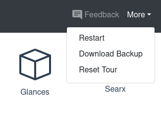

Das hier ist ein großes Ding! Von Anfang an haben wir allen gesagt, dass Portal ein früher Prototyp ist. Deine Daten sind nicht sicher und können jederzeit verloren gehen. Technisch gilt das weiterhin, aber jetzt kannst du jederzeit ein vollständiges Backup all deiner Daten herunterladen.

Öffne einfach das Dropdown „More“ (früher „Settings“), wähle „Download Backup“, und der Download startet.

Das Backup ist ein ZIP-Archiv mit allen Daten, die dein Portal einzigartig machen: seine interne Datenbank, alle Dokumente und Medien, die du hochgeladen hast, und den Zustand all deiner Apps. Öffne das Archiv ruhig und sieh dich darin um.

⚠️ Vorsicht: Im Archiv liegt auch die eindeutige Identität deines Portals (der technische Begriff ist „Private Key“). Gib sie an niemanden weiter, sonst kann sich jemand als dein Portal ausgeben!

## Warum ist dieses Feature so wichtig?

### Bereit für den produktiven Einsatz

Mit dem Backup-Feature kann man sein Portal endlich produktiv nutzen, also für mehr als nur Tests und Demos. Solange man regelmäßig ein Backup herunterlädt, kann man sicher sein, dass die eigenen Daten nicht verloren gehen.

Und falls dem Portal etwas zustößt, lässt sich aus dem Backup ein identischer Ersatz aufsetzen. (Auch wenn dieser Vorgang noch nicht automatisiert ist.)

### Vertrauen aufbauen

Wir betonen immer, dass Portal für die Nutzenden arbeitet und nur für sie – denn sie sind die Kundschaft. Ein Teil davon ist, Vendor-Lock-in zu verhindern und es allen zu ermöglichen, Portal jederzeit zu verlassen und alles mitzunehmen. Mit dem Backup-Feature ist das trivial einfach. In einem ZIP-Archiv steckt keine proprietäre Technologie.

Wenn du technisch versierter bist, kannst du die Apps, die du auf deinem Portal nutzt, sogar auf eigener Hardware starten, ihren Zustand aus dem Portal-Backup mounten und sie lokal einfach weiterbenutzen, genau da, wo du aufgehört hast. Du behältst also immer die volle Kontrolle.

## Wie es weitergeht

Das Backup-Feature in seiner jetzigen Form ist ein erster Wurf, der fürs Erste funktioniert. Aber es bleibt noch viel zu tun. Ein kleines Beispiel: Damit niemand das Backup vergisst, bauen wir eine regelmäßige Erinnerung ein.

Langfristig sollen Backups aber vollständig automatisiert laufen. Jede Nacht (oder in einem anderen Intervall) sollen sie in einen Cloud-Storage geschoben werden, natürlich verschlüsselt, wo wir sie sicher aufbewahren und jederzeit zum Download bereitstellen. Schließlich ist eines der Versprechen von Portal, vollständig gemanagt zu sein.

Wenn du weitere Ideen oder Wünsche zu Backups oder zu Portal allgemein hast, beteilige dich gern auf unserer Feedback-Plattform.
