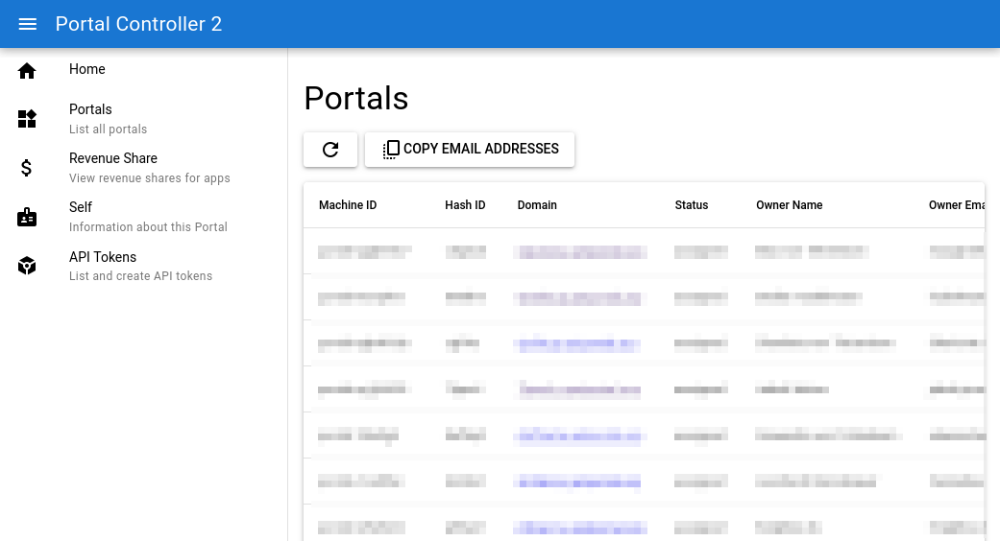
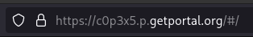
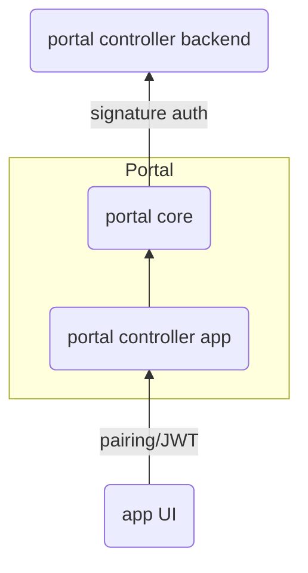

Das Portal-Ökosystem ist mehr als die Software, die auf den Portals selbst läuft, es besteht auch aus einer Reihe administrativer Funktionen. Unter anderem

* legen sie Portals an, weisen sie zu, upgraden und entfernen sie,
* verwalten sie Portal-Ressourcen,
* überwachen sie die Portal-Gesundheit,
* nehmen sie Zahlungen an und verarbeiten sie,
* empfangen und verarbeiten sie App-Nutzungsberichte für den [Revenue Share](https://docs.freeshard.net/developer_docs/revenue_share/).

Bisher lief der Zugriff auf diese Werkzeuge über ein Command Line Interface, aber mit wachsender Komplexität fand ich, dass es Zeit für etwas Grafisches ist.

Es gibt den Spruch „[Eat your own dog food](https://en.wikipedia.org/wiki/Eating_your_own_dog_food)“, also: Nutze die Produkte, die du selbst baust. Die neue grafische Oberfläche wurde deshalb eine brandneue Portal-App. Und sie zeigt sehr gut, wie einfach es mit Portal sein kann, wenn man es richtig einsetzt.

## Portal-Controller-Backend

Die neue App für die Arbeit mit den Backend-Diensten heißt „Portal Controller“. Sie bringt ein eigens dafür entwickeltes Backend mit, das für den Anfang einen Teil der Funktionalität umsetzt, die zuletzt wichtig geworden ist. Das Portal-Controller-Backend ist eine Python-App mit einer REST-API auf Basis von [FastAPI](https://fastapi.tiangolo.com/), gehostet über Azure Container Apps. Das ist ein Bruch mit dem bisherigen Backend auf Basis von Azure Functions, das sich – nachdem die Flitterwochen vorbei waren – als zu umständlich herausgestellt hat. Ziel ist, die gesamte Funktionalität auf das neue Backend zu migrieren und das alte abzuschalten, auch wenn das noch dauern kann.

Es läuft zu jedem Zeitpunkt genau eine Instanz des Backends, aber es hat keine öffentliche Web-UI. Stattdessen bietet es eine REST-API, die gezielt dafür gebaut ist, von der neuen Portal-App aufgerufen zu werden. Und genau hier spielen die Identitäts- und Authentifizierungsfeatures von Portal ihre Stärken aus.

## Portal-Controller-App



Grundsätzlich lässt sich jede Portal-App in zwei Teile zerlegen: die Backend-Logik, die auf jedem einzelnen Portal läuft, und das Frontend, das im Browser läuft. Bei der Portal-Controller-App steckt der Großteil der Logik im Frontend. Das Backend ist sehr schlicht. Sein einziger Zweck ist, das Frontend auszuliefern und die Aufrufe, die das Frontend an die `/api`-Endpunkte macht, an den Portal Core weiterzuleiten, der auf dem Portal selbst läuft.

Was hat es mit dieser Weiterleitung auf sich? Um das zu verstehen, hier noch einmal ein paar Fakten zum Identitätskonzept von Portal.

* Jedes Portal hat eine eindeutige Kennung, die Portal-ID. Du siehst sie als Teil der URL und oben links in der Portal-UI.
* Die Portal-ID hängt mit dem [Private-/Public-Key-Paar](https://en.wikipedia.org/wiki/Public-key_cryptography) des Portals zusammen (sie ist ein Hash davon). Das sind kryptografische Schlüssel, mit denen das Portal seine Identität über das Internet nachweisen kann. Den Public Key meines Portals kannst du dir hier ansehen.
* Der Portal Core kann Requests an andere Hosts im Internet schicken und diese Requests mit dem Private Key des Portals signieren. Die empfangende Seite kann damit prüfen, dass der Request von genau diesem Portal kam und nicht von jemand anderem.
* Deine Geräte (Notebook, Smartphone usw.) haben ein Pairing mit dem Portal – ein [JSON Web Token](https://jwt.io/), das mit dem Private Key des Portals signiert ist.

<figure markdown="span">
    
    
    <figcaption>Die Portal-ID in der Adresszeile und in der Web-UI.</figcaption>
</figure>

Alles zusammengenommen heißt das: **Wer ein Portal nutzt, muss über Authentifizierung überhaupt nicht nachdenken**. Wie du im folgenden Diagramm siehst, werden Requests von der App-UI an das Portal-Controller-Backend auf dem Weg zur App durch den normalen Pairing-Mechanismus authentifiziert, dann passiert die oben erwähnte Weiterleitung, bei der der Request zum Portal Core geht. Dort wird er mit dem Private Key des Portals signiert und anschließend an das Portal-Controller-Backend geschickt. Das Backend kann nun die Signatur prüfen und zweifelsfrei das Portal identifizieren, das den Request gestellt hat.



Was hier passiert, ist ein kleiner Vorgeschmack auf die Vision, die ich für Portal habe, und auf den Grund, warum jedes Portal diese scheinbar zufällige ID hat. Sie erlaubt es jedem Portal, kryptografisch zu beweisen, dass ihm diese ID gehört – ganz ohne menschliches Zutun. Keine Passwörter, kein „Login mit _irgendwas_“, gar nichts.

Für die Zukunft wünsche ich mir:

1. dass Portals _untereinander_ auf dieselbe Weise sprechen können – Ende-zu-Ende-verschlüsselt und authentifiziert – und
2. dass Apps dieses Feature nutzen, um ein nahtloses Erlebnis zu bieten.

## Was macht die Portal-App eigentlich?

Ich habe erwähnt, dass das Backend der Portal-Controller-App (das auf jedem Portal, nicht das in Azure) sehr schlicht ist. Es liefert das Frontend aus und leitet Requests an den Portal Core weiter. Tatsächlich enthält es überhaupt keinen eigenen Code, sondern basiert auf einem nginx-Image mit einer eigenen Konfiguration, die so klein ist, dass ich sie hier vollständig zeigen kann:

```nginx
http {
  include /etc/nginx/mime.types;

  server {
      listen 80;
      server_name localhost;

      location /api { ## (1)!
          rewrite ^/api/(.*)$ /internal/call_backend/api/$1 break;
          proxy_pass http://portal_core;
      }

      location / { ## (2)!
          root /usr/share/nginx/html;
          index index.html;
      }
  }
}
```

1. Das ist der Teil, der Requests an `/api` an den Portal Core weiterleitet, wo ein spezieller Endpunkt die Aufrufe annimmt, die Signatur des Portals anbringt und sie an das Backend weiterreicht.
2. Das ist der Teil, der das Frontend ausliefert – nur statische HTML-, CSS- und JavaScript-Dateien, erzeugt mit [Quasar](https://quasar.dev/).

Elegant an diesem Aufbau ist, dass das Frontend einfach Aufrufe an `/api` machen und damit direkt mit dem Backend in Azure sprechen kann. Es muss sich um den Portal Core und um Authentifizierung überhaupt nicht kümmern, was die gedankliche Last in der Frontend-Entwicklung deutlich senkt.

## Autorisierung

Bisher habe ich nur über Authentifizierung gesprochen, also darüber, wer man ist. Genauso wichtig ist Autorisierung, also was man tun darf. Nachdem das Portal-Controller-Backend das Portal identifiziert hat, das einen Request gestellt hat, muss es entscheiden, ob der Request erlaubt ist. Wie macht es das?

Es gibt viele Methoden für Autorisierung, ich habe fürs Erste eine einfache gewählt: nur eine Liste von Berechtigungen, die direkt Portal-IDs zugeordnet sind. Hier ein Auszug aus dem Datenbankeintrag meines eigenen Portals:

```json
{
    "hash_id": "c0p3x5wgkav3qfcya7y7lh69kyze03hpfc693gzyzy3apls95nzz8zh24k3wqw9ajcv5vwrqw2a5lw6qy55vy6z4e9dlwhfl3544ls2",
    "domain": "c0p3x5.p.getportal.org",
    "owner": "Max von Tettenborn",
    "permissions": [
        "list_portals",
        "read_portal",
        "modify_portal",
        "delete_portal",
        "read_revenue_share",
        "modify_revenue_share"
    ]
}
```

Der echte Eintrag hat mehr Felder, aber das ist der relevante Teil. Wie du siehst, habe ich die Berechtigungen, Portals aufzulisten, zu lesen, zu ändern und zu löschen sowie den Revenue Share zu lesen und zu ändern. Das sind alle Berechtigungen, die das Portal-Controller-Backend derzeit kennt. Mit weiteren Features kommen weitere Berechtigungen dazu.

Wenn es so weit ist, mehr Menschen in die Verwaltung des Portal-Ökosystems einzubinden, kann ich ihren Portals einfach die nötigen Berechtigungen zuweisen. Damit können sie sofort die Portal-Controller-App für ihre Arbeit nutzen.

Langfristig wird dieses simple System aber wohl durch etwas wie [RBAC](https://en.wikipedia.org/wiki/Role-based_access_control) ersetzt werden müssen.

## Backends für andere Apps

Das Portal-Controller-Backend kennt natürlich von Anfang an alle existierenden Portals – schließlich legt es sie selbst an. Andere Apps, die ein Backend mit der beschriebenen Art von Authentifizierung anbieten wollen, müssten Einträge für Portals beim ersten Kontakt anlegen. Das wäre überhaupt kein Problem, denn jeder signierte Request eines Portals enthält auch die Portal-ID.

Wichtig: Auch das wäre für die nutzende Person völlig transparent. Ein Portal für die Kommunikation mit irgendeinem Backend zu verwenden, lässt sich immer so umsetzen, dass man nicht darüber nachdenken muss. Das Backend erkennt das Portal einfach immer sicher wieder.

> **Das in deiner eigenen App umsetzen**
>
> Im Portal-Controller-Backend habe ich die Bibliothek [requests-http-signature](https://pypi.org/project/requests-http-signature/) genutzt, um die Signaturen zu prüfen.
> Sie setzt allerdings voraus, dass du den Public Key der sendenden Seite schon hast –
> den musst du in diesem Fall über den Endpunkt `/core/public/meta/whoareyou` des Portals holen.
> Das müsstest du also in deiner `HTTPSignatureKeyResolver`-Klasse erledigen.
> Und wenn du asynchronen Code schreiben willst, sind zusätzliche Schritte nötig, weil die Bibliothek das nicht unterstützt.
> Falls du hängen bleibst, frag mich gern um Hilfe – diese Mühen habe ich schon hinter mir.

## Fazit

Wenn ich mit Leuten über die Vision von Portal spreche, sage ich oft, dass das eigene Portal der eigene digitale Zwilling sein sollte, oder die eigene Vertretung im Internet. Das funktioniert nur, wenn es eine beständige Identität hat, an der andere Instanzen im Netz es erkennen können – so wie wir unser Aussehen und unseren Namen haben, an denen uns andere Menschen in der realen Welt erkennen.

Mit dem jetzigen Identitätssystem braucht es keine Passwörter mehr und keine anderen Verfahren, die menschliches Zutun verlangen. Ich hoffe, dass wir eines Tages ungläubig den Kopf darüber schütteln, was wir früher alles über uns ergehen lassen mussten.

> Kannst du den Wert nahtloser Authentifizierung erkennen?
> Willst du deine eigene Portal-App bauen, die dieses Feature nutzt?
> Diskutiere mit im Portal-Discord oder schreib mir deine Gedanken per E-Mail.
