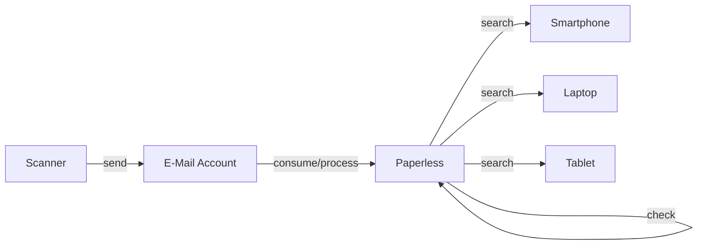
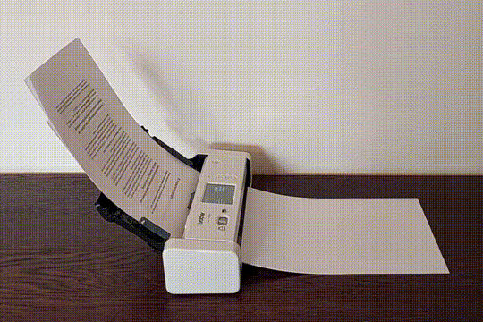
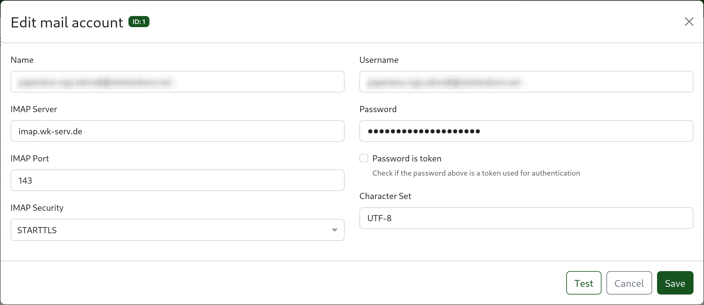
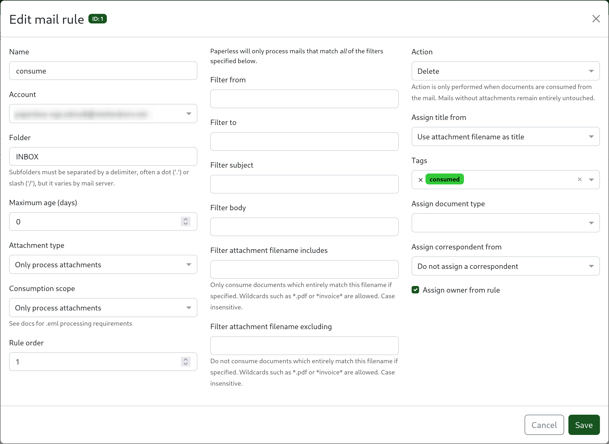
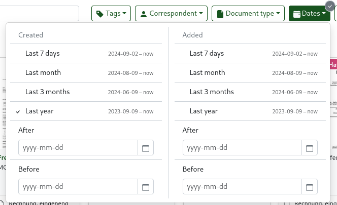
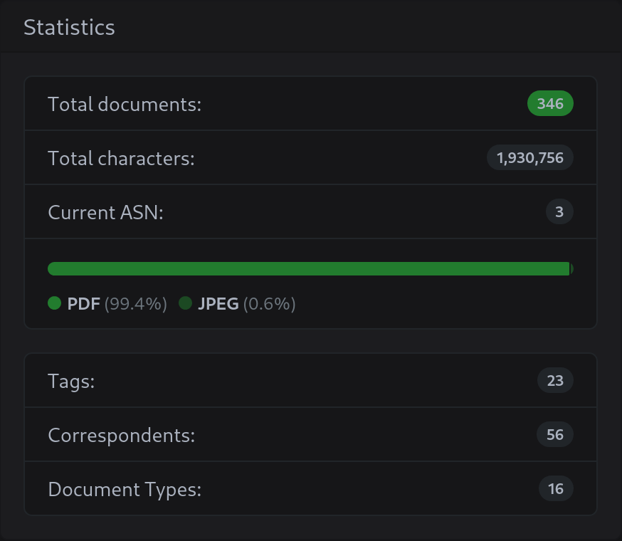

Eine der nützlichsten Portal-Apps ist Paperless. Gerade in Ländern wie Deutschland, wo Papier im Alltag immer noch eine große Rolle spielt, hilft dir Paperless dabei, den Überblick über deine Dokumente zu behalten und Schreibtisch und Regale leer zu halten. Nachdem ich mein Setup in den letzten Wochen optimiert habe, bin ich an einem Punkt angekommen, den ich (fast) für ideal halte. Tatsächlich macht es inzwischen fast Spaß, Dokumente zu scannen und zu sortieren. Ich zeige dir, wie das aussieht.

## Warum Paperless?

Dokumente verwalten zu müssen, ist in der modernen Welt ziemlich universell (manchmal auf frustrierende Weise), und es gibt viele Wege, das zu tun. Du kannst das Papier in immer weiter wachsenden Ordnern oder Kisten aufbewahren. Du kannst es scannen und auf deinem Rechner ablegen. Oder du legst es in einen Cloud-Dienst wie Dropbox oder Google Drive. Viele Menschen machen wahrscheinlich eine Mischung aus alldem. Aber alle diese Wege haben ihre Nachteile: die Zeit, die Scannen und Sortieren kostet, das Risiko, Dokumente zu verlieren, oder die Datenschutzbedenken beim Ablegen in der Cloud.

Paperless auf Portal ist ein Weg, diese Nachteile loszuwerden oder zumindest deutlich zu verkleinern. Mit einem guten Setup und seinen cleveren Features macht es das Organisieren schnell und mühelos. Weil die Dokumente ausschließlich auf dem Portal gespeichert und verarbeitet werden, sind sie immer verfügbar und sicher, werden automatisch gesichert und stehen unter deiner alleinigen Kontrolle (wie alles auf deinem Portal). Meines Wissens gibt es keinen anderen Dienst, der diese Kombination bietet.

Hier siehst du auch genau die drei Merkmale, die die DNA von Portal ausmachen: Einfachheit, Allgegenwärtigkeit und Eigentum.

## Überblick

Kurz gefasst sieht mein Paperless-Workflow so aus:

1. Ich scanne alle eingehenden Dokumente und werfe die Originale weg.
2. Der Scanner schickt die gescannten Dokumente über eine eigene E-Mail-Adresse direkt an Paperless auf dem Portal.
3. Paperless verarbeitet die Dokumente automatisch: Es extrahiert den Text, kategorisiert das Dokument (Datum, Typ, Korrespondenz) und vergibt Tags.
4. Danach sehe ich die eingelesenen Dokumente in Paperless manuell durch und korrigiere Fehler.
5. Ist alles sortiert, kann ich über die Paperless-Weboberfläche von jedem Gerät aus nach Dokumenten suchen.

Gehen wir die einzelnen Schritte genauer durch. Wenn du magst, kannst du dir auch [dein eigenes Setup bauen](#probier-es-selbst-aus) und mitmachen.

## Scannen

Zum schnellen und einfachen Scannen nutze ich einen Duplex-Einzugsscanner, aber wenn du geduldig bist, tut es natürlich auch ein Flachbettscanner. Meiner ist ein _Brother ADS-1700W_, klein und leicht, und er frisst einen Stapel Papier im Nu. Er macht einfach Freude, ich kann ihn sehr empfehlen.

Der Scanner hängt in meinem WLAN und kann gescannte Dokumente direkt an eine E-Mail-Adresse schicken. Ich habe das als Kurzbefehl gespeichert, sodass ein Scan nur einen Tipp braucht. Die Adresse, an die er schickt, ist eine eigene, die ich nur zu diesem Zweck angelegt habe.

> Ich habe hier ein eigenes E-Mail-Konto nur für eingehende Dokumente eingerichtet. Du kannst aber genauso gut dein bestehendes Konto nutzen und Paperless nur Mails von einer bestimmten Absenderadresse oder mit einem bestimmten Betreff einlesen lassen. Künftig soll Portal seinen eigenen Mailserver hosten, dann kannst du dir diesen Schritt sogar ganz sparen.

## Einlesen

Dieses E-Mail-Konto wird von Paperless überwacht. Einmal pro Minute prüft es auf neue Mails und liest alle Anhänge als neue Dokumente ein. Ich kann also ein Dokument scannen, und binnen einer Minute liegt es in Paperless. Manchmal leite ich auch Mails mit Anhängen, die ich behalten will, an diese Adresse weiter, dann landen sie ebenfalls in Paperless. Und wenn irgendwo im Dateisystem ein Dokument herumliegt, lade ich es einfach über die Weboberfläche hoch.

Paperless mit dem E-Mail-Konto zu verbinden funktioniert genauso, wie man einen Mail-Client wie Thunderbird oder Outlook verbindet.

Ist das E-Mail-Konto eingerichtet, kannst du Regeln anlegen, die Paperless sagen, wie eingehende Mails verarbeitet werden sollen. In meinem Fall mit einem eigenen Konto brauche ich nur eine einzige Regel, die alle Anhänge einliest und die Mail danach löscht. Ein netter Trick ist, allen Dokumenten den Tag `consumed` zu geben. So kann ich leicht nach Dokumenten filtern, die ich noch nicht geprüft habe.

## Organisieren

Paperless kann Text aus den Dokumenten extrahieren und sie anhand des Inhalts selbst kategorisieren. Nach etwas automatischem Lernen wird es darin ziemlich gut, sodass ich meistens gar nichts korrigieren muss.

Trotzdem prüfe ich mithilfe des `consumed`-Tags jedes Dokument noch einmal von Hand. Nach dem Prüfen und Korrigieren entferne ich den Tag „consumed“. Das dauert pro Dokument meist nur ein paar Sekunden, ist also kein Aufwand.

Manche Menschen müssen sich vielleicht erst daran gewöhnen, dass es keine Ordner gibt, in die sie ihre Dokumente legen können. In Paperless liegen alle Dokumente stattdessen in einer einzigen Liste, und organisiert wird über Metadaten und Filter. Das ist tatsächlich mächtiger und flexibler.

Wenn du darüber nachdenkst: Ordner sind nur eine Möglichkeit, Dokumente nach Kategorien zu sortieren – und das können Tags genauso. Statt ein Dokument in einen Ordner namens _Wohnung_ zu legen, gibst du ihm einfach den Tag _Wohnung_. Tags sind sogar flexibler als Ordner, weil ein Dokument mehrere Tags haben kann; soll ein Dokument dagegen in mehreren Ordnern liegen, musst du Kopien anlegen. Eine steuerlich absetzbare Rechnung für deine Wohnung kann zum Beispiel die Tags _Wohnung_ und _Steuer_ haben.

> **Was, wenn ich das Original behalten muss?**
>
> Von manchen besonders wichtigen Dokumenten musst du schlicht eine Papierkopie behalten. Dafür hat Paperless ein spezielles Feature: die _Archiv-Seriennummer_ (ASN). Die Idee: Du scannst das Dokument trotzdem und verwaltest es in Paperless, behältst aber zusätzlich die Papierkopie. Damit du die Kopie schnell wiederfindest, vergibst du eine ASN (in Paperless und auf einem Post-it auf dem Original) und legst alle Kopien nach ASN sortiert in einen Ordner. Suchst du das Original, suchst du zuerst in Paperless, schaust die ASN nach und findest damit die Papierkopie über eine [binäre Suche](https://en.wikipedia.org/wiki/Binary_search) im Ordner.

## Suchen

Dank dieser Metadaten ist die Suche nach Dokumenten einfach und mächtig. Ich kann die Dokumentenliste nach Datum, Typ, Korrespondenz oder Tags filtern.

Wenn zum Beispiel die jährliche Steuererklärung ansteht, filtere ich nach Typ _Rechnung_ und Datum _letztes Jahr_ und habe damit schon eine gute erste Auswahl an Dokumenten. Meistens stellt sich heraus, dass einige der Rechnungen nicht relevant sind, also verfeinere ich den Filter, indem ich diese _Korrespondenzen_ aus der Liste nehme. In wenigen Minuten habe ich eine vollständige Liste aller relevanten Dokumente.

Ein weiteres mächtiges Feature ist, dass ich jetzt alle meine Dokumente von jedem Gerät aus zur Hand habe. Ich habe das schon erwähnt, aber es lohnt sich, es zu wiederholen. Stell dir vor, du bist auf einem Amt oder an einem ähnlichen Ort und merkst, dass du ein Dokument brauchst, das zu Hause liegt. Das passiert einfach nicht mehr.

## Fazit

Du musst nicht alle deine Dokumente auf einmal digitalisieren. Ich habe vor etwa einem Jahr einfach mit den neu eingehenden Dokumenten angefangen, und das hat schon sehr geholfen. Alte Dokumente zu digitalisieren steht noch auf meiner Todo-Liste, ist aber nicht dringend.

Die Vorteile davon, papierlos zu werden, sind jetzt schon klar: weniger Kram, einfacheres Sortieren, bessere Verfügbarkeit und – am wichtigsten – mehr freie Zeit, die nicht fürs Sortieren und Suchen von Dokumenten draufgeht.

## Probier es selbst aus

Ich hoffe, dieser Artikel hat dich neugierig gemacht, Paperless auf Portal auszuprobieren. Wenn du magst, kannst du mit einer kostenlosen Testphase starten.

:sparkles: Test-Portal erstellen

Und wenn du Fragen hast oder Hilfe bei deinem Setup brauchst, komm gern in den Portal-Discord.
