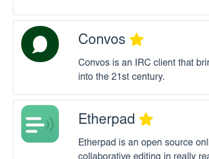
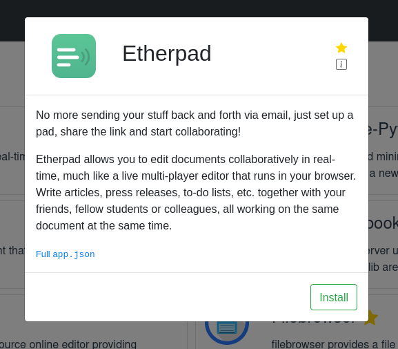
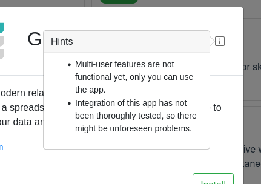
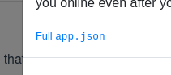
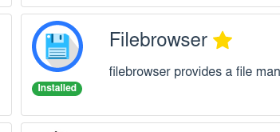

⚠️ Wenn du ein Portal hast, starte es jetzt neu, dann aktualisiert es sich selbst. (Über das Einstellungsmenü oben rechts.)

Als wir den App Store zum ersten Mal entworfen haben, ging es uns vor allem darum, schnell etwas Funktionierendes zu bauen. Er war immer als erster Wurf gedacht, den wir irgendwann erweitern oder ersetzen würden. Diese Aufgabe haben wir jetzt angepackt.

Nachdem im Lauf der Zeit mehr Apps dazugekommen sind, haben wir beobachtet: Manche lassen sich richtig gut in Portal integrieren, andere nicht. Ein typischer Haken ist ein Registrierungs- oder Login-Flow, den wir nicht allein über Konfiguration loswerden. Darüber haben wir im letzten Beitrag geschrieben. Diese nicht ganz so gut integrierten Apps funktionieren aber trotzdem und können sehr nützlich sein. Wir wollen sie nicht aus dem Store heraushalten.

Was uns fehlte, war eine Möglichkeit zu zeigen, welche Apps das Portal-Erlebnis so liefern, wie es gedacht ist: sofort nutzbar, kein Setup, keine Registrierung, kein Login. Wir brauchten eine Möglichkeit, Featured Apps hervorzuheben.

Genau das haben wir umgesetzt – und wenn wir schon dabei waren, haben wir das Backlog nach weiteren Ideen zur Verbesserung des App Stores durchsucht, die sich mit der Zeit angesammelt hatten. Das Ergebnis ist ein App Store, der deutlich fertiger wirkt (wenn auch noch nicht ganz).

Und um die Änderungen zu unterstützen, haben wir außerdem Version 2.0 des app.json-Formats eingeführt (siehe die Docs hier und [hier](https://docs.freeshard.net/developer_docs/submitting/#metadata-for-the-app-store)). Die Versionierung dieses Formats haben wir ebenfalls im letzten Beitrag beschrieben, und sie hat sich schon jetzt als sehr nützlich erwiesen: Änderungen sind damit einfach und unkompliziert.

Hier die vollständige Liste der Änderungen.

👉 Featured Apps erlauben uns, Apps hervorzuheben, die besonders gut funktionieren. Sie werden außerdem oben in der Liste einsortiert.

👉 Kurz- und Langbeschreibung lassen uns einen kurzen Text in der App-Liste und einen ausführlicheren auf der App-Seite anzeigen.

👉 Apropos: Die App-Seite gab es vorher gar nicht. Sie ist der Ort für ausführlichere Informationen zu einer App. Den Installieren-Button haben wir auch dorthin gelegt.

👉 Bei manchen Apps enthält die App-Seite zusätzlich ein Hinweis-Popup. Dort können wir wichtige Informationen zur Nutzung oder zum Verhalten einer App unterbringen.

👉 Wer neugierig auf solche Dinge ist, kann sich die vollständige app.json jeder App anzeigen lassen.

👉 Außerdem haben wir die Tab-Ansicht abgeschafft, in der man zwischen App Store und der Liste der installierten Apps umschalten konnte. Stattdessen markieren wir jede installierte App mit einem Label und lassen dich direkt von ihrer Seite aus deinstallieren.

Während der Arbeit an den Verbesserungen sind uns noch viele weitere Dinge eingefallen, für die wir uns diesmal keine Zeit nehmen konnten. Rechne also mit einem weiteren Update. Und sag uns, was du davon hältst und welche Features du dir sonst noch wünschst.
