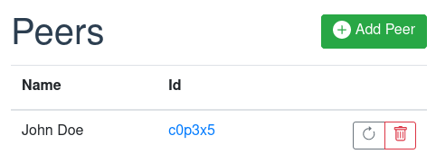
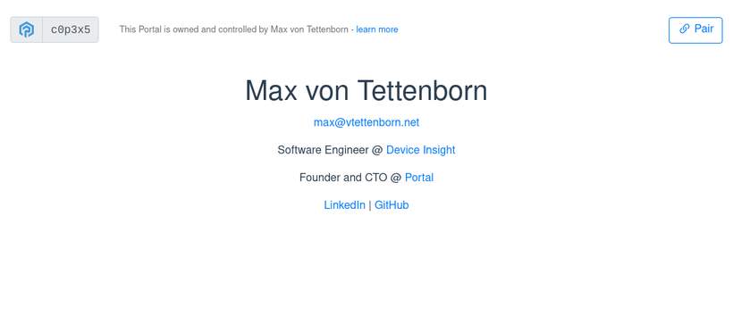
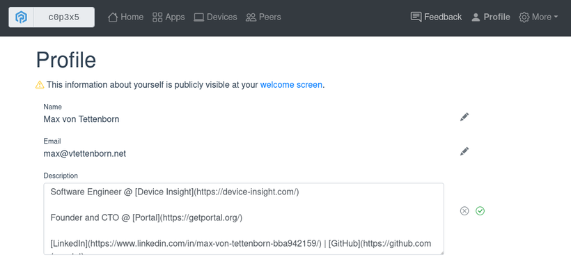

Seit unserem letzten Update hier auf Patreon ist einige Zeit vergangen. Zum einen waren wir mit vielen kleineren Aufgaben beschäftigt – technisch wie geschäftlich –, die keinen eigenen Blogpost rechtfertigen. Ein paar davon haben es immerhin in unsere Newsletter geschafft. Der andere Grund für die lange Stille ist das nächste große Feature, ein besonders kniffliges und zeitaufwendiges: Peer-2-Peer-Kommunikation.

Von Anfang an war es ein Kernstück der Vision von Portal, Portals miteinander zu verbinden und so ein dezentrales P2P-Netzwerk zu bilden. Konzeptionell ähnelt das allen sozialen Netzwerken, in denen du eine Liste von Kontakten oder Freundschaften pflegst. Aber während zentralisierte Plattformen wie Facebook, Twitter und Co. weiterhin alle Daten kontrollieren und jede Verbindung sehen, löst Portal sein Souveränitätsversprechen ein. Deine Peers (so nennen wir sie) liegen auf deinem Portal – also in deiner privaten Domäne – und Portals sprechen direkt miteinander, ohne Zwischenstelle.

Selbstverständlich ist die gesamte Kommunikation Ende-zu-Ende-verschlüsselt und authentifiziert: eine notwendige Voraussetzung für Privatsphäre. Möglich macht das der [IETF-Draft-Standard HTTP Message Signatures](https://datatracker.ietf.org/doc/draft-ietf-httpbis-message-signatures/), der in normalen Endkundendiensten selten zum Einsatz kommt – dort sind nervige Passwörter die Norm. Zu den Eigenheiten von Portal passt er dagegen gut. Jedes Portal hat ohnehin eine kryptografische Identität (daraus leitet sich auch seine 6-stellige ID ab), es hat also alles, was es zum Signieren von Requests braucht. Und weil die Person, der es gehört, von allen ihren Geräten dasselbe Portal nutzt, muss kein Private Key geteilt werden (was ohnehin eine schreckliche Idee wäre). Das unterstreicht sehr schön, dass ein Portal die Identität seiner Besitzerin oder seines Besitzers im Internet ist.

Mit dem neuen Feature kann eine App jetzt eine Liste von Peers abrufen und HTTP-Requests an sie schicken. Das sendende Portal hängt eine Signatur an den Request, das empfangende Portal prüft sie. Da jedes Portal ohnehin ein gültiges Zertifikat hat, entsteht so ein verschlüsselter und beidseitig authentifizierter Kanal.

Weil das Feature brandneu ist, nutzt es noch keine App. Die App-Entwicklung ist jetzt am Zug, ihre Apps entsprechend anzupassen.

Mehr technische Details findest du [in der Dokumentation](https://docs.freeshard.net/developer_docs/peering/).

## Persönliches Profil und Willkommensbildschirm

Beim Verwalten von Peers ist es wichtig, echte Namen zu sehen und nicht nur Portal-IDs. Das heißt: Wem ein Portal gehört, sollte seinen oder ihren Namen hinterlegen können, damit er in der Kontaktliste der Peers auftaucht. Wir mussten dieses Feature also ohnehin als Voraussetzung fürs Peering bauen, haben die Gelegenheit aber gleich genutzt, um einen weiteren wichtigen Aspekt von Portal umzusetzen: eine öffentliche Seite bzw. einen Willkommensbildschirm.

Wir beschreiben Portal oft als die Identität einer Person im Internet. Ihr Avatar oder ihre Vertretung. Mit der besonderen Kombination von Eigenschaften, die Portal mitbringt, ergibt das Sinn: Es ist immer an und online, und es gehört und untersteht ausschließlich der Person, die es nutzt. Ein erster Schritt in diese Richtung ist, jedem Portal ein öffentliches Gesicht zu geben. Etwas, das man Leuten zeigt, die die Adresse des Portals aufrufen. Bisher sah man dort nur den Pairing-Bildschirm.

Jetzt gibt es eine öffentliche Seite, die du mit Text in Markdown-Syntax füllen kannst. Du kannst dich selbst oder deine Projekte beschreiben, Links zu anderen Online-Profilen setzen und so weiter. Damit lässt sich deine gesamte Internetpräsenz an einem einzigen Punkt zusammenführen.

Wir sind gespannt, wie das Feature genutzt wird! Wie immer gilt: Fragen gern über unseren Discord-Server, Feature-Wünsche und anderes Feedback über das Feedback-Formular.
