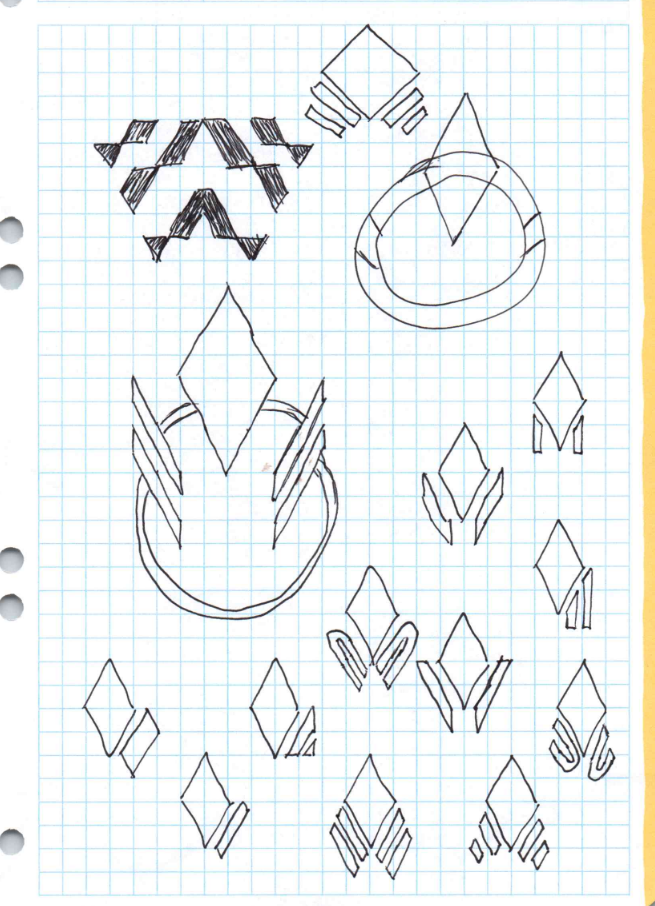
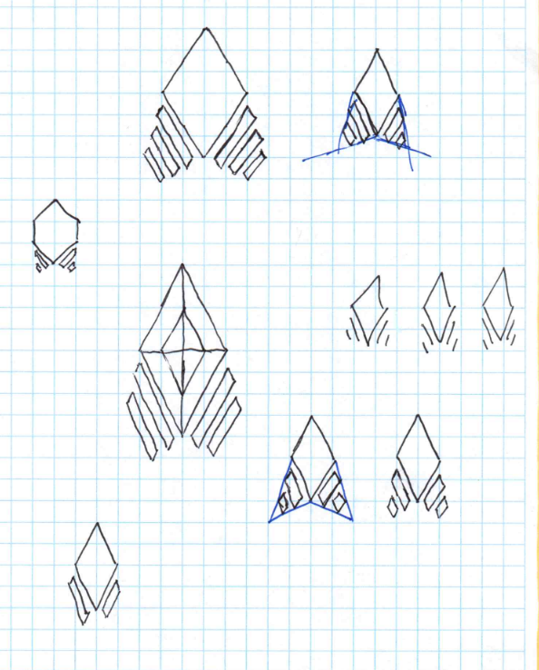
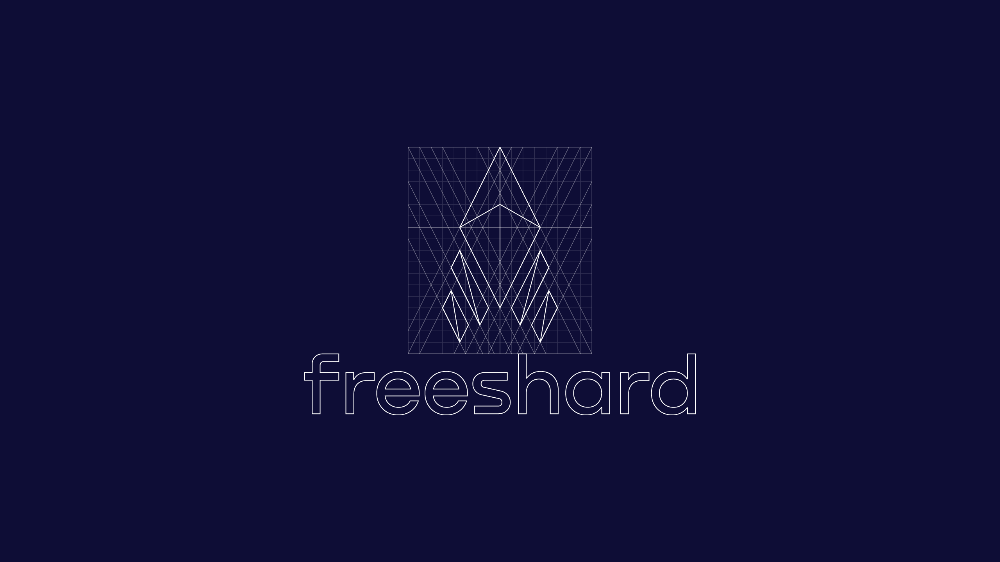

Die Marke _Portal_ war immer als Platzhalter gedacht, und zuletzt fühlte sie sich zunehmend abgestanden an. Also habe ich gebrainstormt und gezeichnet und bin auf einen neuen Namen und ein neues Logo gekommen. Ab jetzt heißt Portal:

## Über Portal

Ganz ehrlich: Auf den Namen _Portal_ bin ich gekommen, nachdem ich das gleichnamige Valve-Spiel gespielt hatte. Ich hatte damals wirklich keinen guten Namen für das Projekt, und Portal fühlte sich irgendwie ok an: kurz, leicht zu merken. Ich wusste nicht, wie ernst das alles werden würde, die Messlatte fürs Branding lag also ziemlich niedrig. Später fand jemand aus dem Team das Logo in einer Stockfoto-Datenbank. Das war alles ein bisschen halbherzig, einfach um etwas zu haben.

Natürlich hat der Name Portal seine Probleme. Er ist ein sehr gewöhnliches Substantiv, das im IT-Bereich sogar noch häufiger auftaucht. Das macht es schwer, einen Domainnamen zu finden – getportal.org ist sperrig, und die TLD _.org_ passt nicht wirklich – und Suchmaschinen setzen ihn nicht weit nach oben. Semantisch ist er außerdem seltsam: Ein Portal ist wie eine Tür, ein Durchgang, der irgendwohin führt. Wohin führt das Produkt _Portal_? Eigentlich nirgendwohin. Es ist eher ein Ziel, eine Sache für sich.

All das passte also nicht, und nachdem ich das Rebranding lange nach hinten geschoben hatte, wuchs dieses Gefühl immer weiter, bis ich die Aufgabe endlich angegangen bin.

## Über Freeshard

Einen neuen Namen zu finden – eigentlich eine neue Identität – hat trotzdem eine ganze Weile gedauert. Das war ein kreativer Prozess, und so ein Prozess lässt sich nicht beschleunigen. Ich habe mir die Aufgabe also immer mal wieder vorgenommen, versucht, auf andere Wörter und Bedeutungen zu kommen, und sie dann wieder liegen lassen, bis zum nächsten Schub Inspiration.

Ein paar der Ideen, die ich transportieren wollte, waren Beständigkeit/Heimeligkeit/Nähe/Verlässlichkeit, Freiheit/Unabhängigkeit/Selbstbestimmung, Wert/Einzigartigkeit. Ich habe mit Varianten und Übersetzungen von Wörtern wie _one, avatar, daemon, deck, hub/center_ und anderen herumgespielt. Am Ende wurde es _freeshard_, und ich bin ziemlich zufrieden damit.

Freeshard ist tatsächlich ein etablierter Begriff, wenn auch nur in der Blase alter Online-Spiele. Wenn jemand, der nicht der Publisher eines Spiels ist, einen eigenen Spieleserver betreibt – mit oder ohne Erlaubnis des Publishers –, nennt man das einen Freeshard. Der Aspekt von Self-Hosting und individueller Freiheit steckt also schon in der traditionellen Bedeutung des Wortes.

Außerdem erinnert der Begriff _Shard_ – Scherbe, Splitter – an ein Stück eines Edelsteins und deutet damit auf Beständigkeit, Wert und Einzigartigkeit hin. Ein Shard ist aber nur ein einzelnes Stück, und viele Shards ergeben ein stimmiges Ganzes. Das ist ein gutes Bild für das Projekt, wo die Peer-to-Peer-Verbindungen zwischen Shards einzelne Werkzeuge irgendwann in ein deutlich nützlicheres Ökosystem verwandeln werden. Und tatsächlich habe ich entschieden, die einzelnen Instanzen künftig _Shards_ zu nennen.

All diese Gedanken sind in den Namen eingeflossen und machen ihn zu einer guten Wahl. Das Sahnehäubchen war dann, dass die Domain freeshard.net frei war – perfekt.

Nächste Aufgabe …

## Das Logo

Ich habe angefangen zu skizzieren und zu kritzeln, wann immer mir danach war. Mit dem Begriff _Shard_ im Namen wollte ich eine Art edelsteinartige Facettenstruktur bauen, aber auch eine gewisse Technikhaftigkeit einbringen. Hier ein paar der Skizzen; das finale Design hat sich überraschend schnell herausgeschält. Es ergab einfach Sinn.

Die Schlichtheit mit nur zwei Winkeln für die Konturen, die Symmetrie, die „Shardigkeit“. Es erinnert mich an eine startende Rakete, aber die Linien lassen sich auch als Funkwellen lesen, wie im WLAN-Symbol. Oder du siehst das zentrale Element als Shard und die kleinen Elemente als die damit gekoppelten Geräte. Wenn ich ganz stark blinzle, erinnert es mich sogar an das Sternenflotten-Logo. Das war natürlich alles nicht geplant, aber es ist immer schön, wenn man sich im Nachhinein Entstehungsgeschichten für sein Logo ausdenken kann.

## Umzug zu GitHub und Fair Source

Wenn ich fürs Rebranding sowieso schon überall im Projekt herumschraube, ist es doch sinnvoll, gleich noch andere große Änderungen anzugehen, oder? Nein, ist es nicht, tatsächlich widerspricht es allen Empfehlungen für Softwareentwicklung, was mich irgendwie nicht davon abhält, es [trotzdem zu tun](/de/blog/app-integration-overhaul/).

Dein Shard soll dein _Zuhause im Internet_ sein (so die Tagline), ein Ort, dem du vertrauen kannst. Ein winziges, unbekanntes Startup, das einen Onlinedienst anbietet, ist allerdings nicht gerade der beste Weg, dieses Vertrauen aufzubauen. Wenn man Leuten aber den Quellcode des Produkts zeigt und sie es sogar selbst hosten lässt, sieht die Sache anders aus. Das ist also der nächste naheliegende Schritt für freeshard.

Leider ist _GitHub_ für das Veröffentlichen von Quellcode nun einmal der mit großem Abstand populärste und meistgenutzte Dienst. Und Portal lag auf Git**Lab**, musste also umziehen.

Dieser Umzug war überraschenderweise nicht so einfach, wie ich erwartet hatte. Eine Org und ein paar Repositories sind schnell angelegt, aber die CI/CD-Pipeline neu zu schreiben kostete mehr Aufwand – und den Code so weit zu bringen, dass er veröffentlicht und von allen, die es ausprobieren wollen, leicht gestartet werden kann, noch einmal deutlich mehr. Bis dahin gab es Portals nur in der vollständig verwalteten Variante, einem viel nachsichtigeren Kontext.

Und dann ist da noch die Lizenz. Ich bin mir noch nicht sicher, ob ich mit einer [Functional Source License](https://fair.io/licenses/) die richtige gewählt habe, aber ich glaube zumindest, dass ich mir damit nicht ins eigene Knie geschossen habe, und das ist ja schon etwas. Vielleicht ändert sich das in Zukunft. Im Moment freue ich mich, dass Leute den Quellcode lesen und ihre eigenen Shards hosten können, was hoffentlich beim Vertrauensaufbau hilft, und gleichzeitig bin ich der Einzige, der einen kommerziellen Dienst aus freeshard bauen darf.

## Fazit

Das war also eine weitere riesige Änderung für das Projekt. Es fühlt sich jetzt erwachsener an, auch wenn die Grundfunktionen dieselben geblieben sind. Ich hoffe jetzt darauf, dass sich eine Community bildet – mit all ihren unvorhersehbaren, chaotischen und produktiven Nebenwirkungen.

Das GitHub-Repository findest du [hier](https://github.com/FreeshardBase/freeshard). Gib ihm gern einen Stern, wenn es dir gefällt. Probier, es lokal laufen zu lassen, das sollte nur ein paar Minuten dauern, [hier sind die Schritte](https://github.com/FreeshardBase/freeshard?tab=readme-ov-file#localhost). Wenn du auf Probleme stößt oder eine Idee für ein Feature hast, [mach ein Issue auf](https://github.com/FreeshardBase/freeshard/issues).

Managed Shards gibt es noch nicht, aber sie kommen bald. In der Zwischenzeit kannst du weiterhin ein managed Portal ausprobieren oder [kaufen](https://getportal.org/#subscribe) (das ist im Grunde immer noch dasselbe).

Ich hoffe, du hast eine gute Zeit damit, und freue mich auf deine Kommentare im Discord oder per [E-Mail](mailto:contact@freeshard.net).
