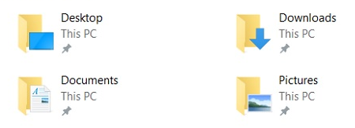
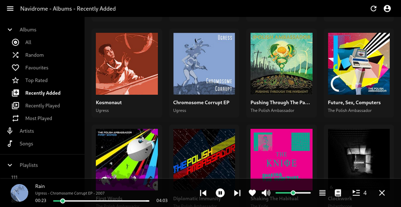
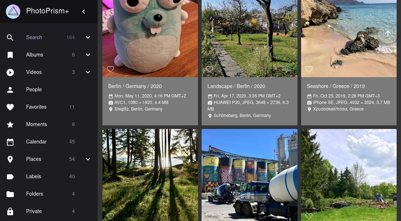

⚠️ Dieses Feature ist nicht abwärtskompatibel. Dein aktuelles Portal muss gelöscht und neu angelegt werden. Schreib uns, sobald du so weit bist.

Die meisten Apps, die du auf deinem Portal installierst, müssen Daten in irgendeiner Form dauerhaft speichern. Dafür gibt es aktuell zwei Wege: a) Sie fordern eine Datenbank auf der Postgres-Instanz an, die auf dem Portal läuft, oder b) sie mounten einen Teil des Portal-Dateisystems.

Beide Varianten isolieren die Daten jeder App von denen aller anderen Apps und des Portals selbst. Die Datenbank wird exklusiv von der App genutzt, und Verzeichnisse werden aus einem app-exklusiven Unterverzeichnis gemountet. Das verhindert jedes Teilen von Daten zwischen Apps und spiegelt ironischerweise genau die Art, wie SaaS-Produkte heute funktionieren – ein Datensilo pro Anwendung. Wir finden dieses Muster nervig und wollen es auf Portal nicht wiederholen.

Wenn du dir praktisch irgendein Betriebssystem ansiehst, findest du solche Datensilos dort nicht. Es gibt ein Dateisystem, und Anwendungen können darin frei Dateien lesen und schreiben. Das gibt den Nutzenden deutlich mehr Freiheit und Kontrolle, und deshalb machen wir es mit Portal ähnlich.

Das Feature heißt „shared directories“ und ist ausführlich [in der Dokumentation](https://docs.freeshard.net/developer_docs/persisting/#shared-directories) beschrieben. Kurz gesagt haben wir ein paar Verzeichnisse hinzugefügt, die zwischen Apps geteilt werden sollen.

Eine App kann Zugriff auf eines oder mehrere davon anfordern, und Portal mountet sie beim Start der App in den Docker-Container. Änderungen, die eine App vornimmt, sehen alle anderen Apps, die dasselbe Verzeichnis gemountet haben.

Dadurch konnten wir auch ein paar neue Apps in den Store bringen, die vorher am fehlenden Feature gescheitert sind. [Navidrome](https://www.navidrome.org/) ist so etwas wie ein selbstgehostetes Spotify für deine ganze Musik, und [Photoprism](https://photoprism.app/) lässt dich alle Fotos und Videos ansehen und organisieren, die du machst. Dazu kommt: Der gute alte [Filebrowser](https://filebrowser.org/) kann jetzt auf alle Shared Directories zugreifen, du kannst damit also ihre Dateistruktur ansehen und bearbeiten.

Wir planen, weitere Apps zu veröffentlichen, die Shared Directories nutzen. Sag uns, welche dir dazu einfallen und welche du dir wünschst.
