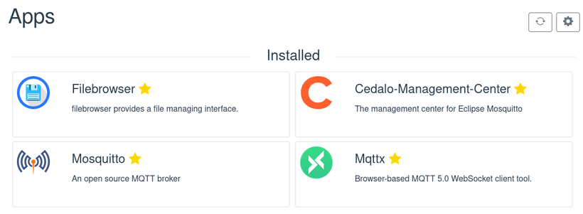

Vor Kurzem sind wir auf Smart-Home-Geräte gestoßen, die über MQTT mit einem Backend sprechen, um Daten zu veröffentlichen oder Befehle zu empfangen. Dieses Backend lässt sich frei konfigurieren, es braucht nur einen MQTT-Broker.

Wir dachten uns: Theoretisch passt Portal mit seinen besonderen Eigenschaften hervorragend zu solchen Geräten und sollte die Rolle der zentralen Steuerzentrale übernehmen können – verwalten, überwachen, automatisieren und so weiter.

Portal ist privat, und das ist wichtig, wenn du damit Messwerte aus deinem Zuhause verschickst und speicherst, denn diese Daten können sehr intim sein. Portal ist einfach zu bedienen und senkt damit die Hürde für die oft ohnehin recht technische Einrichtung von Smart-Home-Geräten. Und es ist von überall und von jedem Gerät aus erreichbar, was dir maximale Freiheit im Umgang mit deinem Smart Home gibt.

In den letzten Wochen haben wir uns also daran gemacht, das möglich zu machen. Angefangen haben wir mit einem einfachen ersten Ziel: Portal soll einen MQTT-Broker betreiben, und man soll ihn leicht konfigurieren können.

## Neue Apps

Neue Funktionen für Portal setzt man natürlich am besten als Apps um, die man selbst installiert. Als MQTT-Broker haben wir Mosquitto gewählt und das Cedalo Management Center als bequeme Oberfläche, um die Zugriffsregeln des Brokers zu verwalten. Beide Apps sind ab sofort im App Store verfügbar.

## Entrypoints-Feature für Portal Core

Damit Mosquitto per MQTT aus dem Internet erreichbar ist, muss sich der MQTT-Port (8883) in den Mosquitto-Container mappen lassen. Bisher unterstützte Portal nur das Mapping eines einzigen HTTP-Ports pro App, es brauchte also eine Erweiterung.

Wir haben das app.json-Format so geändert, dass du statt eines einzelnen Ports nun mehrere Entrypoints definieren und für jeden das Protokoll (und damit den nach außen offenen Port) festlegen kannst. Die Änderung ist in der aktualisierten Dokumentation beschrieben. Die Mosquitto-App ist die erste, die dieses Feature nutzt.

## Anleitungen für häufige Aufgaben

Auch mit Ein-Klick-Installation bleibt die eigentliche Einrichtung deiner Geräte ein Prozess mit einigen Schritten. Vor allem das Verwalten von Client-Zugangsdaten und Berechtigungen lässt sich nicht überspringen, wenn die Sicherheit halbwegs stimmen soll. Um dabei zu helfen, haben wir eine [kurze Schritt-für-Schritt-Anleitung](https://docs.freeshard.net/user_guides/smart_home/) geschrieben, die Installation, Einrichtung und einen einfachen Smoke-Test abdeckt.

Das ist die erste von vielen Anleitungen, die wir im neuen Bereich „User Guides“ der Dokumentation ergänzen wollen.

## Fazit

Das ist der erste Schritt, um Portal als festen Bestandteil von Smart Home und IoT zu etablieren. Die nächsten Schritte sind schon geplant, etwa weitere Apps, die beim Automatisieren, Überwachen und Steuern helfen.

Wenn du mit dem neuen Feature experimentierst (oder auch nicht), würden wir sehr gern hören, was du davon hältst. Jede Art von Feedback hilft uns weiter. Schreib uns, nutze unsere Feedback-Plattform oder chatte direkt mit uns auf unserem Discord-Server.

Wir freuen uns, von dir zu hören!
