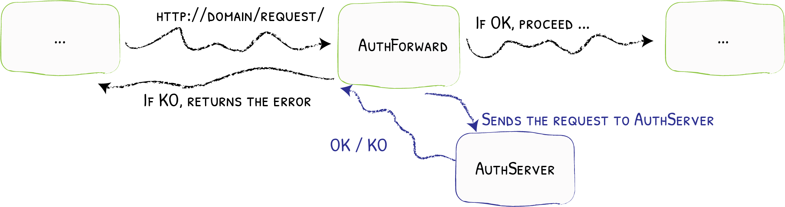
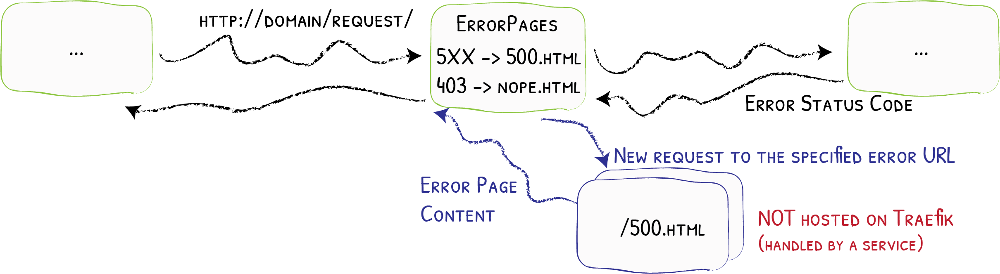

## Hintergrund

Apps laufen auf Portal über docker-compose. Wenn du eine App installierst, wird die docker-compose.yml, die alle Apps enthält, neu gerendert und der Prozess neu gestartet. Dadurch nimmt docker-compose die neue App auf, zieht sie und startet sie.

Bis vor kurzem hieß das allerdings: Jede App, die du installiert hast, läuft dauerhaft. Das hat die Zahl der installierbaren Apps stark begrenzt, denn der Flaschenhals war der RAM des Portals – 1 GB beim aktuellen Setup.

Da mussten wir etwas tun. Und der naheliegendste Ansatz ist, Apps nur bei Bedarf zu starten, so wie du es vom Smartphone kennst. Damit das funktioniert, haben wir mehrere neue Features gebaut, die ineinandergreifen und die Nutzung dabei angenehm halten.

## App-Nutzung erkennen

Um eine App bei Bedarf zu starten, muss Portal erst einmal erkennen, dass sie benutzt wird. Zum Glück ist das unkompliziert. Wir haben ohnehin schon das [Forward-Auth-Feature von Traefik](https://doc.traefik.io/traefik/middlewares/http/forwardauth/) für die Zugriffskontrolle verwendet. Der Portal Core ist dabei der Auth-Server und wird deshalb bei allen Requests an alle Apps aufgerufen.

## Apps starten und stoppen

Container, die über docker-compose definiert sind, lassen sich trotzdem über Kommandos an den Docker-Daemon starten und stoppen. Genau das macht der Portal Core, nichts anderes.

Immer wenn ein erfolgreicher Auth-Request für eine App beim Portal Core ankommt, prüft er, ob die App läuft, und schickt andernfalls ein Start-Kommando. Er speichert außerdem den Zeitstempel des Requests, und ein geplanter Task, der alle paar Sekunden läuft, sucht nach Apps, die länger nicht benutzt wurden, und stoppt sie auf demselben Weg.

## Splash Screens

Da Apps jetzt nicht mehr dauerhaft laufen, kann es passieren, dass jemand eine App auf dem Home Screen anklickt und dann warten muss, bis sie gestartet ist und Requests annimmt. Diese Zeit müssen wir irgendwie überbrücken, und zwar so, dass es sich natürlich anfühlt. Üblich ist dafür ein Splash Screen, und genau den haben wir umgesetzt.

Der Splash Screen kann natürlich nicht Teil der App selbst sein, denn a) es sind Apps, die wir nicht selbst bauen, und b) wenn der Splash Screen gebraucht wird, läuft die App noch gar nicht. Also wird er vom Portal Core ausgeliefert. Es ist ein einfaches statisches Dokument mit dem Logo der App (statisch als Data-URL eingebettet) und ihrem Namen. Es lädt sich außerdem alle paar Sekunden neu, sodass der Reload die App öffnet, sobald sie läuft.

Im Backend müssen wir dafür eine Art Routing bauen. Wenn die App nicht erreichbar ist, wollen wir stattdessen mit dem Splash Screen antworten. Auch hier nutzen wir ein Traefik-Feature. Die Error-Page-Middleware ist eigentlich für eigene Fehlerseiten gedacht, aber da man den Splash Screen als eine Art Fehlerseite sehen kann, können wir sie auch hier verwenden.

## Den Lifecycle definieren

Mit all diesen Features funktioniert das automatische Starten und Stoppen von Apps gut. Was fehlt, ist eine Möglichkeit für App-Entwickelnde, das Verhalten zu konfigurieren. Manche Apps starten schnell und können früh gestoppt werden, andere sollten länger laufen. Manche sollten überhaupt nie gestoppt werden.

Der richtige Ort dafür ist natürlich die app.json. Wir haben sie in früheren Beiträgen behandelt und auch erklärt, wie ihr Format versioniert werden kann. Mit dem lifecycle-Abschnitt sind wir bei Version 3.1 gelandet. Er erlaubt uns, das Idle-Timeout zu definieren, nach dem eine App gestoppt wird, oder das automatische Stoppen ganz abzuschalten.

Künftig würden wir gern eine Möglichkeit einbauen, eine App regelmäßig zu starten, auch wenn sie nicht aktiv benutzt wird. Manche Apps wie ChangeDetection würden davon profitieren. Und noch weiter in der Zukunft wollen wir Apps in die Lage versetzen, ihr Stopp- und Startverhalten selbst zu steuern, indem sie einen internen Endpoint aufrufen. Das ist natürlich nur für Apps sinnvoll, die speziell für Portal gebaut oder angepasst wurden, und die haben wir noch nicht.

Gibt es weitere Features rund um App-Lifecycle-Management, die du dir wünschst? Schreib es in die Kommentare oder per E-Mail. Oder noch besser: Nutze unser neues Feedback-Tool!
