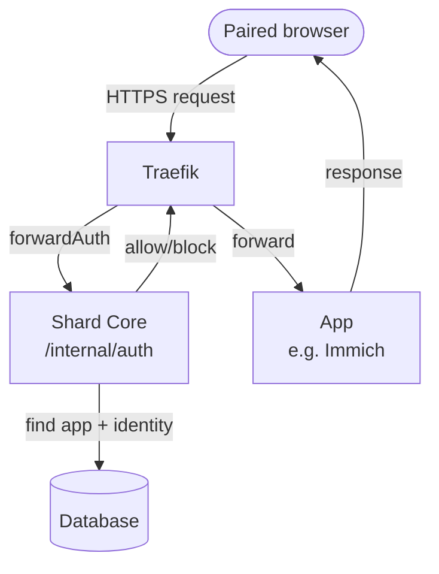

Schon eine Weile gab es ein Problem mit der Immich-App. Im Web startete sie meistens gar nicht. Und wenn doch, war sie quälend langsam beim Starten und beim Laden von Bildern. Kurioserweise funktionierte die Mobile-App. Ich hatte mir vorgenommen, genau diese App zu reparieren, kam aber nicht dazu. Vor ein paar Tagen legte dann ein Durchgang durch alle Apps, um sie zu aktualisieren, das eigentliche Problem offen. Es war dasselbe Problem, das auch andere Apps plagte und langsam machte, zum Beispiel KitchenOwl. Diese Apps funktionierten zwar, aber sie machten keinen Spaß. Lange Wartezeiten zwischen Aktion und Reaktion ließen sie einfach träge wirken.

## Wie Requests innerhalb eines Shards laufen

Jeder Request, der auf einem Shard ankommt, geht zuerst durch Traefik. Dann wird entschieden, ob er zur App durchgelassen oder blockiert wird. Alle Requests von gekoppelten Geräten dürfen durch, ebenso Requests an einen öffentlichen Endpunkt. Das entscheidet die Shard-Core-Anwendung. Und das heißt: Traefik leitet jeden Request an diese Anwendung weiter, wo die Entscheidung fallen muss. Wie ein Türsteher, der bei jedem einzelnen Schluck deines Getränks den Ausweis prüft, nicht nur einmal am Eingang.

Um diese Entscheidung zu treffen, muss der Shard Core ein paar Informationen abfragen. Um welche Art App geht es? Wie ist ihr Berechtigungsmodell konfiguriert? Welches Gerät will Zugriff? Das steht alles in der Datenbank, die Datenbank muss also abgefragt werden. Und für eine Abfrage braucht es eine Datenbankverbindung. Diese Verbindung wird nicht jedes Mal neu aufgebaut, sondern aus einem Pool von Verbindungen gezogen, die bereitstehen, genutzt und danach an den Pool zurückgegeben werden.

## Der Engpass

Wie sich herausstellte, zog jeder einzelne Request zwei Verbindungen aus dem Pool, um die Frage zu beantworten, ob er erlaubt ist oder blockiert werden muss. Außerdem hatte der Pool nur vier Verbindungen gleichzeitig verfügbar. Das ist die Standardeinstellung, und ich habe sie nie hinterfragt, ich habe sie nicht einmal bewusst wahrgenommen. Wenn eine App beim ersten Start aber 30 oder 40 Requests aufmacht, können nur die ersten zwei sofort bedient werden. Alle anderen warten darauf, dass Datenbankverbindungen zurückgegeben und neu vergeben werden. Ein ganzer Schwung Requests blockiert lange. Die Menge staut sich hinter der Absperrung, während der Türsteher sie in Zweiergruppen abarbeitet.

Bei Apps wie Immich oder Actual, die beim Start viele Verbindungen aufmachen, lief der lange Schwanz aus gestauten und wartenden Requests sogar häufig in den 45-Sekunden-Timeout des Browsers, und die App lud überhaupt nicht.

Dieses Problem zu debuggen war besonders knifflig, weil die blockierten Requests nie bei der laufenden Anwendung ankamen. Der Browser gab sie einfach auf, nachdem sie zu lange gedauert hatten. In den Logs der Anwendung war nichts zu finden. Es passierte schlicht kein wirklich erkennbarer Fehler. Es war nur eine Verschlechterung der Performance, die sich auswirkte wie eine nicht reagierende Anwendung. Aber ohne die beobachtbaren Nebenwirkungen echter Exceptions.

## Der naheliegende Fix reicht nicht

Der erste Reflex wäre nun, die Größe des Datenbank-Pools vom Standardwert 4 auf etwa 20 zu erhöhen. Damit könnten sofort viel mehr Requests gleichzeitig bedient werden. Das verschiebt allerdings nur das Ziel, und Apps mit noch größeren Request-Bursts würden weiterhin in ein ähnliches Problem laufen. Außerdem ist es nicht umsonst, eine Verbindung aus einem Pool zu holen, damit die Datenbank abzufragen und sie zurückzugeben – auch das kostet Latenz, die weiterhin bei jedem Request obendrauf käme. Es muss also einen besseren Weg geben.

Nach einem Blick darauf, was für jeden Request eigentlich aus der Datenbank abgefragt wird, wurde die Lösung ziemlich klar. Denn die benötigten Informationen änderten sich nicht besonders oft. Es sind die Identität des Shards und die des anfragenden Geräts. Und es sind die Metadaten und der Zustand der App. Diese Felder ändern sich nicht im Millisekunden- oder Sekundentakt, sondern eher in Minuten, Stunden oder Tagen. Sie lassen sich also cachen. Aber natürlich muss man, sobald man etwas cacht, über die Invalidierung des Caches nachdenken – oft beschrieben als eines der zwei schweren Probleme der Informatik, neben dem Benennen von Dingen und Off-by-one-Fehlern.

## Blinker-Signale

Kurze Randnotiz: shard-core nutzt einen einfachen Signal-Bus auf Basis der [Blinker](https://blinker.readthedocs.io/en/stable/)-Bibliothek. Ein Signal ist einfach ein Objekt, das aufgerufen und abonniert werden kann. Beim Aufruf ruft es alle seine Abonnenten auf, und so muss die aufrufende Funktion nicht wissen, wer diese Abonnenten sind. Wenn ein Signal von mehreren verschiedenen Stellen aus aufgerufen werden muss, kann das eine n-zu-n-Komplexität (jede aufrufende Stelle ruft alle Konsumenten) auf zwei Eins-zu-n-Komplexitäten reduzieren (n Aufrufende zu einem Signal, ein Signal zu n Konsumenten).

Ich habe das System in shard-core eingebaut, weil ich es damals konzeptionell elegant fand, aber in der Arbeit damit zeigte sich, dass es gar nicht so oft gebraucht wird (das n ist meistens klein) und dass es eine eigene Quelle für Probleme und Komplexität ist. Ich habe also eine ganze Weile überlegt, es zu entfernen und die Aufrufe einfach direkt zu machen.

Zurück zum Problem der Cache-Invalidierung: Genau hier kam der Signal-Bus wirklich gelegen. Er hat es mir erlaubt, Caches aufzubauen, die sich selbst anhand eines empfangenen Signals invalidieren: An jeder Stelle, an der die gecachten Daten verändert werden, wird ein Signal (etwa `on_apps_update` oder `on_identity_update`) ausgelöst, das die Konsumenten über diese Änderung informiert. Die Cache-Invalidierung ist einfach einer dieser Konsumenten. Die Stellen, an denen mutiert wird, wissen jetzt also nicht einmal vom Cache.

Weil dieser Fix dank der vorhandenen Signale so leicht war, neige ich inzwischen wieder dazu, sie zu behalten.

## Das Ergebnis: null Datenbankverbindungen

Mit dem Cache liegt die Zahl der Datenbankverbindungen auf dem Hot Path jedes Requests jetzt bei null. Die Wirkung auf die Apps ist verblüffend. Sie laden schnell, sie machen Spaß. Bei Immich kann ich kaum schnell genug scrollen, um die Thumbnails beim Laden zu sehen.

Der Patch hat 60 Zeilen Code hinzugefügt und 25 entfernt. Und er hat aus einem schmerzhaften Erlebnis ein schönes gemacht. Und das ohne Änderungen an der UI, ohne komplizierte Einrichtung, ohne Migration, ohne alles. Richtig gute Effizienz. Richtig gute Wirkung für so eine kleine Änderung.

Meine zwei wichtigsten Erkenntnisse sind diese. 1. Performance und Geschwindigkeit sind kein weiches Ziel. Sie sind kein Nice-to-have. Sie können das Erlebnis grundlegend verändern. Ich habe einen Vortrag von Linus Torvalds gesehen, in dem er Git zum ersten Mal vorstellte, und das Publikum bei Google (das SVN nutzte) hat es nicht verstanden – aber er hatte recht. Und dieser Fix war eine richtig gute Erinnerung daran. 2. Datenbankverbindungen und -abfragen erzeugen spürbaren Overhead, selbst wenn die Datenbank auf demselben Host läuft. Wenn du davon zu viele auf einem Hot Path hast, summiert sich das und wird bemerkbar.

Das Update ist bereits auf allen bestehenden und künftigen Shards ausgerollt. Wenn du einen hast, schau dir Apps, die dir vorher langsam vorkamen, vielleicht noch einmal an. Wenn du keinen hast, bist du [hier](https://freeshard.net/de/trial/) zu einer kostenlosen 24-Stunden-Testphase eingeladen.
